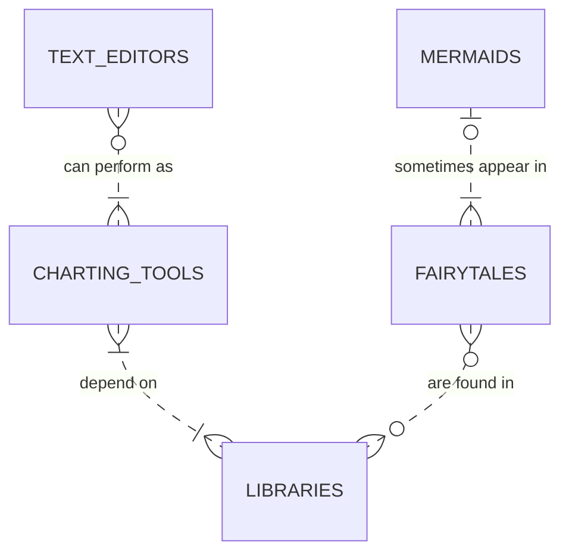
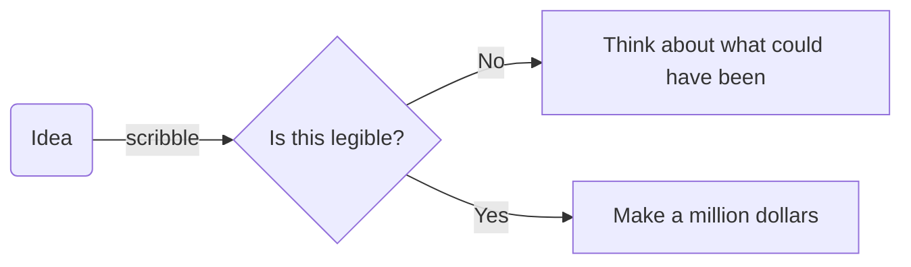
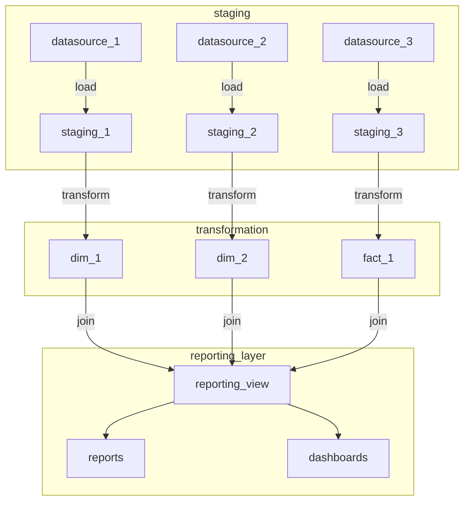

It's the 14th of February so rather buy any useless stuff I don't need for a fake holiday, I thought I'd play with a charting library. I have only recently discovered [Mermaid](https://mermaid-js.github.io/mermaid/#/), an awesome way to create charts using what they describe as "Markdown-inspired syntax".

For example, this somewhat questionable ER diagram...



...can be rendered with just a few lines of code.

```
erDiagram
          MERMAIDS |o..|{ FAIRYTALES : "sometimes appear in"
          TEXT_EDITORS }o..|{ CHARTING_TOOLS : "can perform as"
          CHARTING_TOOLS }|..|{ LIBRARIES : "depend on"
          FAIRYTALES }o..o{ LIBRARIES : "are found in"
```

It seems trite, but scribbling out ideas on paper is something I still find really useful but it's something I mostly do for my own benefit. When it comes to sharing these artworks with collaborators, I'm often the only one that can reliably decipher them. So a concise and lightweight way to share is something I'm in the market for.



I've never really gotten on with tools like Visio. I fell at the first learning curve hurdle and it didn't help that I was usually asked to do something with it as afterthought at the tail end of a project. There are scores of lighter options, desktop and browser based, but nothing compares to being able to create these diagrams right from your editor of choice.

I've been using them a lot recently to get my head around a new BI setup at work that relies on a lot of nested SQL views. I found using the flowchart type to be a really simple way to document the different layers the data goes through as I've been working through the code without having to leave my editor. Another advantage is how easily they can be embedded in markdown documentation right there in the repository we are working on.



There is syntax for adding colour and nested elements of charts in subgraphs as I've illustrated above as well as using font awesome icons. An easy to get started with examples of all the chart types is using the [mermaid live editor](https://mermaid-js.github.io/mermaid-live-editor/) which will render charts as you edit them.

I'm using a vscode plugin that can will render them in the preview pane but it doesn't support all the features unfortunately. Meanwhile while [Gitlab](https://docs.gitlab.com/ee/user/markdown.html#mermaid) automatically renders charts embedded in markdown files, Github doesn't currently support this. That said, there's a cross browser plugin that will that for you.

Finally, there's a [plugin](https://github.com/Braincoke/gridsome-plugin-remark-mermaid) for Gridsome that renders them at build time which I'm using to embed them in these blog posts. This is much easier than trying to mess around with diagrams in binary formats when publishing. I did run into problems trying to get a Gannt chart to render nicely though.

Overall, I find Mermaid's approach to creating diagrams perfect for different bits of my workflows and they are supported across multiple platforms thanks to a wealth of third party tools. I'm glad I found finally adopted them.
